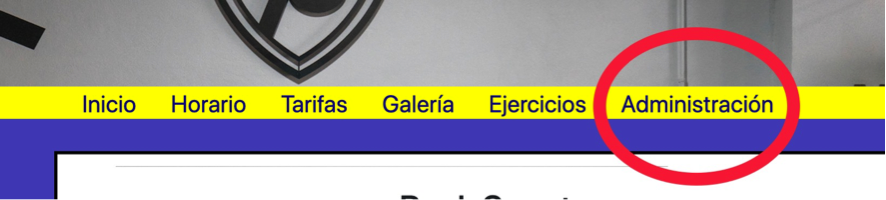
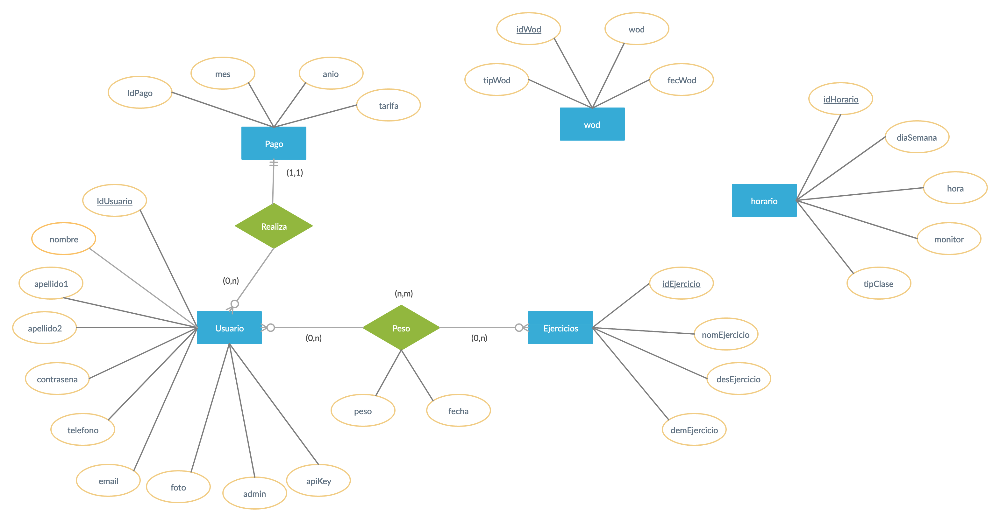

<h1>BOX78</h1>

&nbsp;

Es una aplicaci&oacute;n desarrollada para un negocio deportivo llamado Box78. En este negocio se practica crossfit, por eso los ejercicios que mostramos en ella (todav&iacute;a quedan muchos por insertar) son de alterofilia, y los wods son mezclas de entrenamiento de alterofilia y cardio.

En la aplicaci&oacute;n podemos encontrar dos tipos de roles, los usuarios(clientes) y el/los administradores. Ambos tienen las mismas funcionalidades, pero el administrador, adem&aacute;s, tiene su parte administrativa, a la cual puede acceder desde el bot&oacute;n &ldquo;Administraci&oacute;n&rdquo; que estar&aacute; disponible una vez que inicie sesi&oacute;n con su cuenta en la que se indique que tiene autorizaci&oacute;n.

Funciones en com&uacute;n:

Barra de navegaci&oacute;n superior:

<ul>
<li>Logo: es un bot&oacute;n que te lleva al inicio.</li>
<li>Redes sociales: pone en contacto la aplicaci&oacute;n con sus respectivas redes sociales.</li>
<li>Salir: Cierra la sesi&oacute;n del usuario.</li>
</ul>

Barra de navegaci&oacute;n central:
<ul>
<li>Horario: Consultar el horario semanal de actividades seg&uacute;n la hora del d&iacute;a.</li>
</ul>
<ul>
<li>Tarifas: Consultar las tarifas que ofrece el box.</li>
</ul>
<ul>
<li>Galer&iacute;a: Ver la galer&iacute;a de fotos.</li>
</ul>
<ul>
<li>Ejercicios: Consultar los ejercicios disponibles, pudiendo ver un v&iacute;deo de c&oacute;mo se realizan.</li>
</ul>

&Aacute;rea del perfil del usuario:

<ul>
<li>Perfil: El usuario podr&aacute; consultar su perfil, modificar sus datos y su foto, y eliminar su perfil.</li>
<li>Mis pesos: En este apartado el usuario podr&aacute; consultar el peso que ha registrado anteriormente de cualquiera de los ejercicios ( si es que ha registrado alguno anteriormente), registrar un nuevo peso o eliminarlo.</li>
<li>Mis h&eacute;roes: Este apartado ser&aacute; muy parecido al anterior pero todav&iacute;a se encuentra en &ldquo;construcci&oacute;n&rdquo;.</li>
</ul>

Funciones del administrador:

Socios: En esta &aacute;rea el administrador puede ver un listado de todos los clientes registrados en la aplicaci&oacute;n.(En un futuro podr&aacute; listar todos los que est&aacute;n en activos y los que ya no).

Wods: Este es el &aacute;rea que da funcionalidad a la p&aacute;gina de inicio, ya que en este apartado el administrador escribe la tarea a realizar cada d&iacute;a y el usuario la ver&aacute; justo cuando entre a la aplicaci&oacute;n.

 Pagos: En este punto el administrador puede registrar los pagos de los cliente, busc&aacute;ndolo por su nombre y a continuaci&oacute;n seleccionando el mes, a&ntilde;o y la tarifa que cliente desea pagar.

API:

He construido una API para consultar el horario. Es necesario introducir la apiKey(esta se crear&aacute; al visitar el perfil) del usuario seguido de las operaciones y los datos necesarios.

La sintaxis&nbsp; que se debe poner en la barra de navegaci&oacute;n para utilizar la API ser&iacute;a:2

&nbsp;

http://localhost:8888/box78/ApiHorario.php?api_Key=&hellip;..&amp;op=&hellip;&hellip;.&amp;monitor=&hellip;

&nbsp;

Ejemplo:

&nbsp;

http://localhost:8888/box78/ApiHorario.php?api_Key=80a38f314fe2e5e7f47c967032126fdd&amp;op=monitor&amp;monitor=Rosa

&nbsp;

Las operaciones que podemos realizar ser&iacute;an:

&nbsp;

Todo: para mostrar todo el horario.

Monitor: para mostrar las clases que impartir&iacute;a ese monitor y los d&iacute;as.

Clase: seg&uacute;n el tipo de clase elegida te muestra los d&iacute;as que se pr&aacute;ctica y el monitor que lo imparte.

D&iacute;a: seg&uacute;n el d&iacute;a de la semana seleccionado te muestra el monitor y el tipo de clase.

&nbsp;

Los datos ser&iacute;an:

&nbsp;

Monitor: 'Rosa', 'Nane', 'Cheri', 'Mafe', 'Monitor'

Clase: 'OpenWod', 'Wod', 'Tecnica', 'Yoga', 'Ni&ntilde;os'

Dia: 'Lunes', 'Martes', 'Miercoles', 'Jueves', 'Viernes'

&nbsp;

Futuras funcionalidades:

&nbsp;

<ul>
<li>&Aacute;rea de &ldquo;Mis H&eacute;roes&rdquo;.</li>
</ul>
<ul>
<li>Que el administrador acepte mediante correo electr&oacute;nico a un nuevo usuario.</li>
</ul>
<ul>
<li>El administrador pueda modificar el horario semana.</li>
</ul>
<ul>
<li>M&aacute;s tareas administrativas(contabilidad, facturas..)</li>
</ul>
<ul>
<li>Que el administrador pueda a&ntilde;adir y cambiar fotos de la galer&iacute;a.</li>
</ul>
<ul>
<li>Y algunas m&aacute;s que ir&aacute;n surgiendo.</li>
</ul>

&nbsp;

El script dela base de datos se encuentra en la carpeta sql con el nombre script.sql, dentro del proyecto.

&nbsp;

Modelo Entidad Relación de mi base de datos:

